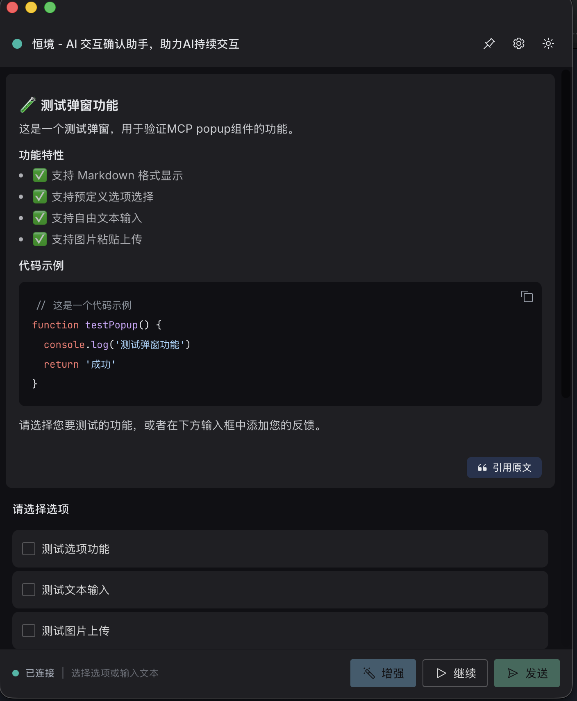
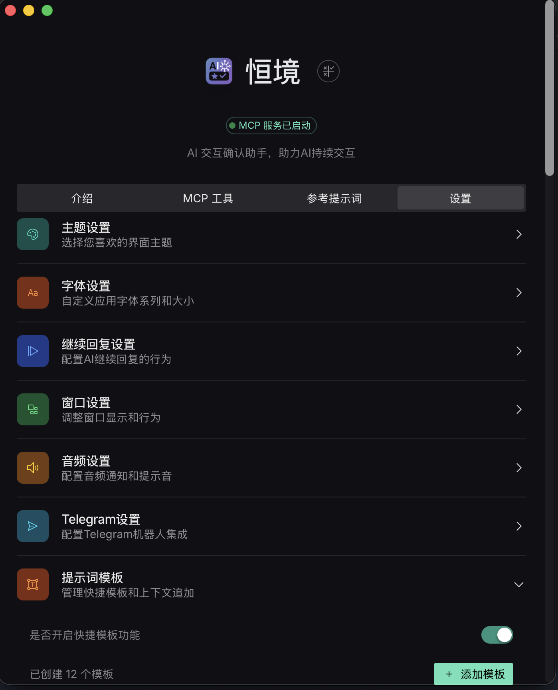

# 恒境 🛑

> **告别 AI 提前终止烦恼，过程介入交互方式，助力 AI 更加持久**

本项目 fork 自 [imhuso/cunzhi](https://github.com/imhuso/cunzhi)，主要进行了命名优化和部分功能改进，使其更适合日常使用和分享。

## 🔄 主要改动

相比原项目，本 fork 主要做了以下调整：

- **命名优化**：将部分不雅命名替换为更友好的中文名称
  - MCP 工具名：`zhi` → `heng`
  - 设置命令：`等一下` → `等`
- **CLI 安装**：新增设置界面一键安装功能，方便部署到系统 PATH
- **输入优化**：优化大文本输入时的性能问题

## 🌟 核心特性

- 🛑 **智能拦截**：AI 想结束时自动弹出继续选项
- 🧠 **记忆管理**：按项目存储开发规范和偏好
- 🎨 **优雅交互**：Markdown 支持、多种输入方式
- ⚡ **即装即用**：简单安装，跨平台支持

## 📸 效果预览

### 🛑 智能拦截弹窗


### ⚙️ 设置管理界面


## 🚀 安装使用

### macOS

1. 下载 [Releases](https://github.com/KerwinKoo/cunzhi/releases) 中的 `.dmg` 文件
2. 将 `恒境.app` 拖入 `/Applications`
3. 打开应用，在设置 → CLI 安装中点击"一键安装"

或手动安装 CLI：
```bash
sudo ln -sf /Applications/恒境.app/Contents/MacOS/恒境 /usr/local/bin/恒境
sudo ln -sf /Applications/恒境.app/Contents/MacOS/等 /usr/local/bin/等
```

### 配置 MCP 客户端

```json
{
  "mcpServers": {
    "恒境": {
      "command": "恒境",
      "autoApprove": ["heng"],
      "timeout": 36000000
    }
  }
}
```

### 打开设置界面

```bash
等
```

## 🔧 工具说明

- **heng**：智能代码审查交互工具
- **ji**：记忆管理工具
- **sou**：代码搜索工具（基于 ACE）
  - 📖 [详细说明](./ACEMCP.md)

## 🛠️ 本地开发

```bash
git clone https://github.com/KerwinKoo/cunzhi.git
cd cunzhi
pnpm install
pnpm tauri:dev
```

构建发布版：
```bash
pnpm tauri:build
```

## 🙏 致谢

- [imhuso/continuum](https://github.com/imhuso/continuum) - 原项目
- [acemcp](https://github.com/qy527145/acemcp) - 代码搜索能力

## 📄 开源协议

MIT License
